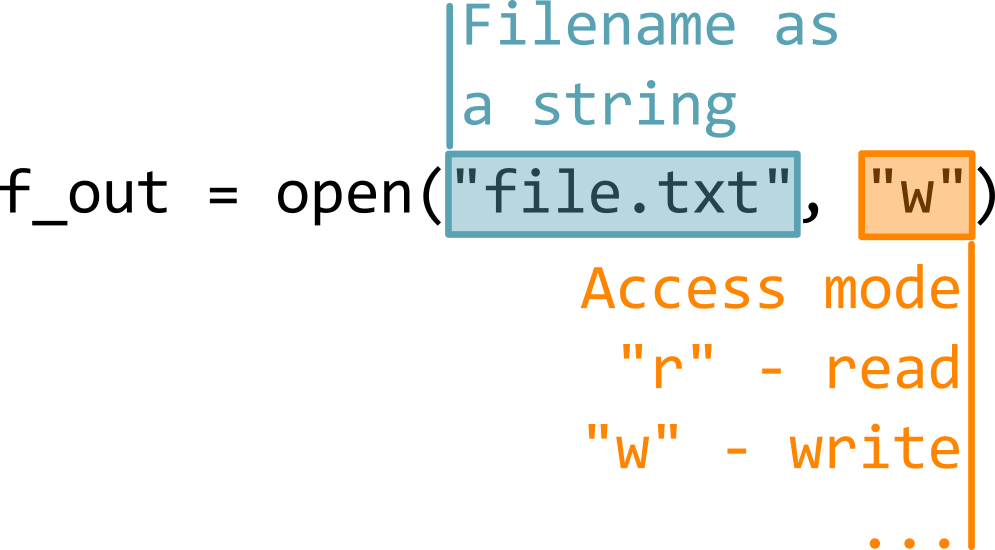

# Exercise 9: Writing into a file

In this exercise, we will learn to write into a file. You will need to this to retrieve the results from your sensor. 

You can use the following Wokwi project:
[https://wokwi.com/projects/452227563937803265](https://wokwi.com/projects/452227563937803265)

## Opening a file 

To work with any file in python, we need to first create a connection to it and save it as a variable. 



<br>

In the above example, we have created a variable `f_out`. This is called a **handle**. This handle is our access to the file and we can use it to write into it. This is because we have selected a flag `"w"` as a mode. There are also other modes and later we will use `"r"` for reading the file.  

To write into your file, you can simply use a method `.write()` as follows:

```python
f_out.write("Message to be saved in the file")
```

We can write only strings into our file and so all the data must be formatted as a string. You can use an f-string formatting which you have seen previously (e.g. `f"{variable1} string messsage {variable2}"`). 

There is a few important things to keep in mind when working with files in python. After your program is done working with the file, you need to close the access to it through the same handle calling:

```python
f_out.close()
``` 

## Testing writing into a file

Now, to test writing into a file, we will do the following:

- Open a file in the way described above (with `open(...)`)
- Afterwards, create a simple while or for loop that counts up (e.g. from 0 to 10).  
  - :bulb: Make sure your loop is not infinite. You can test that by simply printing out the variable you would save into the file in every iteration of your loop. 
- Once you know your loop is working correctly, write the values of the counter in each loop into a file as described above. If you want them to be saved on a new line every time, add the end of line character `"\n"` after each one.
- Once your loop is finished, don't forget to close the access to the file, which might otherwise get corrupted. 
- At the end of your program, print out an exit statement that will let you know that the program is finished. 

### Checking the results

It is unfortunately not completely straightforward to check the results of writing into a file in Wokwi, but it is also not too complex. 

#### Expected results

Your program has run, printed your exit statement that you put at the end of your script and exited successfully. You should now see the python command line: 

```
MicroPython v1.22.0 on 2023-12-27; Generic ESP32 module with ESP32 Type "help()" for more information.
>>>
```

You can write python command in the line starting with `>>>`. We will first check if your file got created by calling `os.listdir()`. This function lists files at your current location which in our case is the root directory of your device. If everything went well, it should show something like this:

```
>>> os.listdir()
['diagram.json', 'main.py', 'output.txt']
```
where `"output.txt"` is how I have called my output file in this case. You can choose whatever name you like. 

#### Opening a file to read it

In the same command line, we will now open the content of the file to check it. You will need to open a handle to access the file, but this time you will use `"r"` (for read) instead of `"w"` for write. 

Once you have your access handle, there are several ways to aceess the content, but in our case we will use `f_in.readlines()`. This will retrieve all lines of your file and print them into the command line. It will not particularly preserve the actual file structure, but you can easily check the content of your file this way. 

> [!NOTE] 
> Make sure that your file contains the values of your counter.

> [!CAUTION] DISCLAIMER 
> **Python works with files in a somewhat unintuitive fashion. Once getting to the end of the file, it will no longer return any further conent! This may look very confusing.**

Let's explain on an example. Your file is called `output.txt` and your values in it are `0123456789`. Calling `.readlines()` once will return the following:

```python
>>> f_out.readlines()
>>> [0123456789]
```

Calling the exact same function **once again** on the exact same file, which has not changed will however return the following:


```python
>>> f_out.readlines()
>>> []
```

This is becuse python has already reached the end of the file, or in other words read everything there is to read in the given handle and it correctly, albeit confusingly, tells you that there is no more to read.

To get around this, you need to open the handle once again in the exact same fashion as you did at the beginning (using the `open(...)` statement). This will prompt the handle to read one again from the beginning. 

> [!TIP] 
> If yopu would like to print the content of your file in a more formatted way, you can instead use a `for` loop in the following way:
> ```pyhton
>for line in f_in:
>    print(line)
>```
> This will maintain the internal structure and correctly interpret escape characters (e.g. `"\n"`). However, this is a bit awkward to write in a command line. 

### Including a time stamp in your data

In the following exercise, we will add a time stamp to each value of your counter. To do that we will need to retrieve a value from the internal clock of our microcontroller board. There are several ways to do that in microphython with varying degrees of resolution. For the purposes of your measuring device, the most convenient will probably be 1 second time resolution. This can be retrieved by a function `time()` which you can import from the module `utime` where you are already importing your function `sleep()`. 

The function `time()` will return the number of seconds since starting the device. 
:bulb: Note that the timer will start at the moment your device reboots, but your program might not be ready to be run yet. This means that the timer values retrieved in reality might not start with 0 or even 1 as we would expect, but  rather often start with 2 or 3 (seconds since the start). This is normal and inevitable and it is due to the time counting being managed by the board's dedicated hardware module and not your program. 

Function `time()` takes no arguments and will return the current time at the moment you call it. Now that you know how to retrieve the time, add a time stamp to your counter and save both in your file.

> [!WARNING]
>  **Make sure to add a sleep function in your loop for at least 0.5 sec, otherwise your program will finish in a fraction of a second and you won't see any increments of the time in your output.**   

> [!TIP]
> The following content is optional, but you may find it useful for your design. If you don't change the name of your file every time you create it, python will happily rewrite it next time you open the same program. This might be unwanted and to avoid it, python provides a specific option for opening a file called **exclusive write**. This returns an error when filename already exists thus protecting it from being rewritten.
> You can implement exclusive write by adding `"x"` to the mode option when opening a file:
> ```python
> f_out = open("file.txt", "wx")
> ```

---

> [!IMPORTANT]  
> ## Wokwi final exercise
> Implement saving into a file in your Wokwi final assignment program. You should save values from your sensor together with a time stamp since your button was first pressed and your program was activated. 
> Check the content of your file after the program has exitted. 


